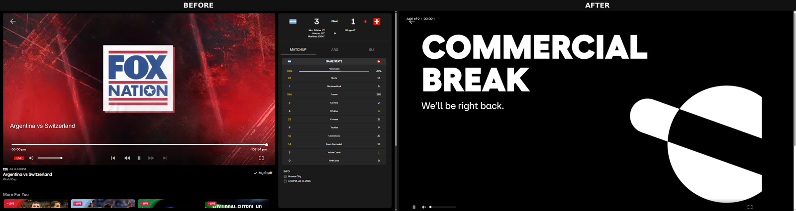

# Stream Widescreen

Hides the side panel on FOX One live sports streams and widens/centers the video for a cleaner view.

## Install (unpacked, no Chrome Web Store needed)

1. Download all the extension files into one folder (e.g. `stream-widescreen/`):
   - `manifest.json`
   - `popup.html`
   - `popup.css`
   - `popup.js`
   - `content.js`

2. Open `chrome://extensions` in Chrome.

3. Turn on **Developer mode** (toggle in the top-right corner).

4. Click **Load unpacked**, then select the `stream-widescreen` folder.

5. The extension icon will appear in your toolbar. Click it and flip the toggle to hide/show the sidebar.

## Updating

If you or I change any file, just click the refresh icon on the extension's card at `chrome://extensions` — no need to remove and re-add it.

## Notes

- Works on `www.fox.com` stream pages.
- Your on/off preference is saved automatically and persists across page reloads.